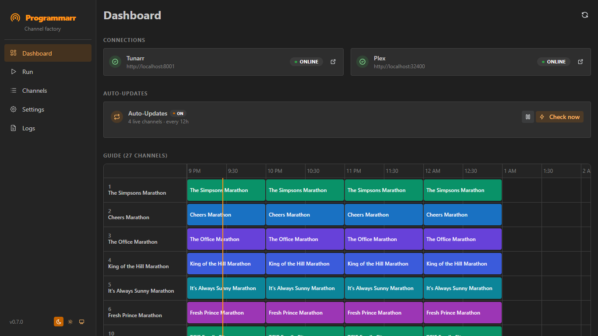
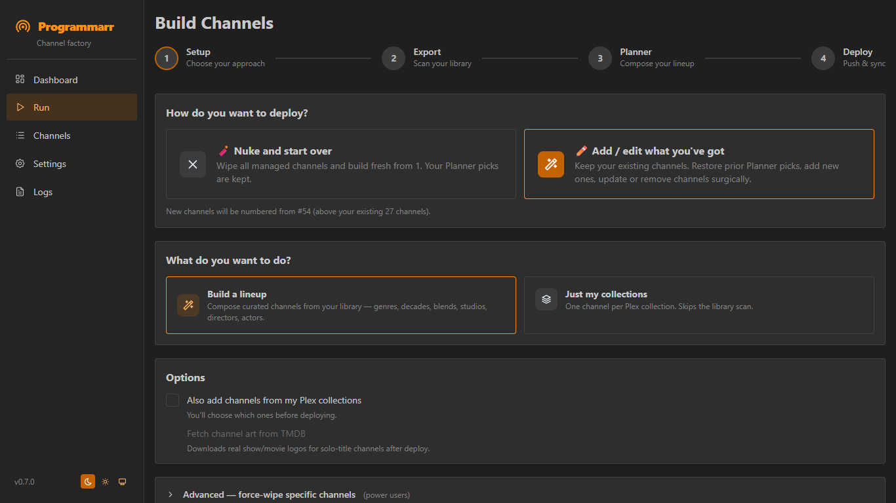
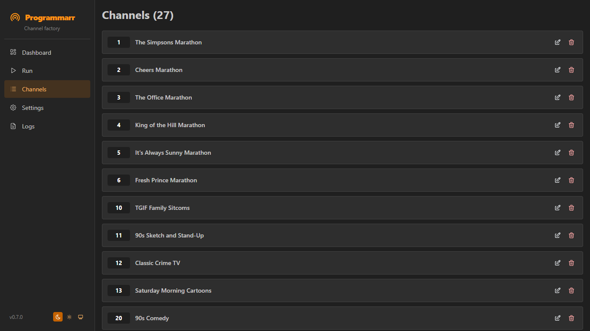
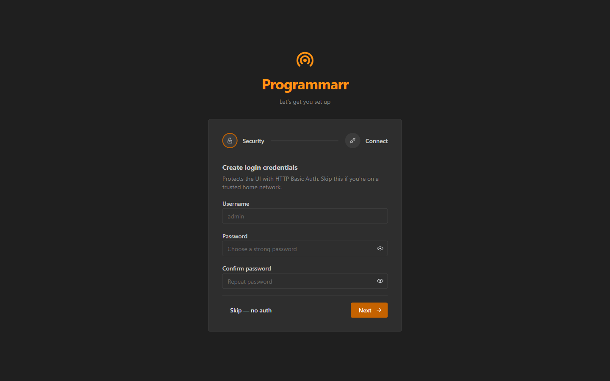
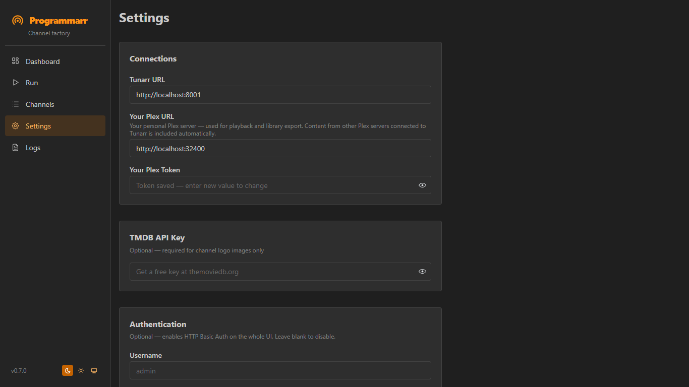

# Programmarr

<div align="center">

**Turn your Plex library into themed virtual TV channels in [Tunarr](https://github.com/chrisbenincasa/tunarr)**

[](LICENSE)
[](https://python.org)
[](https://hub.docker.com)
[](https://claude.ai/claude-code)

</div>

---

Programmarr is a self-hosted web app that turns your Plex library into a **curated lineup of themed virtual TV channels** in Tunarr — with a web UI that feels like Sonarr or Radarr.

You **compose** the lineup in a **Planner**: pick the genres, decades, studios, directors, and actors you want, check the exact channels from a live, counted list, and deploy. It's all deterministic — no AI required — with an **optional** AI layer that discovers themed channels your filters miss (Heist Films, Time Travel, Sports Underdogs) and splits broad pools by *tone* (Feel-Good vs Raunchy Comedies).

Channels can also be **self-maintaining**: mark one "live" and Programmarr re-checks it against your library on a schedule and patches it in place — new episodes and new franchise films appear on their own, no redeploy.

**Requires:** [Tunarr](https://github.com/chrisbenincasa/tunarr) + Plex

---

## Quick Start

### 1. Pull and start

```bash
docker compose up -d
```

That's it — the image is pre-built on [GHCR](https://github.com/AlpineArchitecture/programmarr/pkgs/container/programmarr). No local build step needed.

### 2. Open the UI

```
http://<your-server-ip>:7979
```

First run shows an onboarding wizard — create a login, enter your Tunarr and Plex URLs, done.

### TrueNAS

Paste this as a complete compose file in Apps → Custom App:

```yaml
services:
  programmarr:
    image: ghcr.io/alpinearchitecture/programmarr:latest
    container_name: programmarr
    restart: unless-stopped
    ports:
      - "7979:7979"
    volumes:
      - /mnt/YourPool/AppData/programmarr/data:/data
```

Replace `/mnt/YourPool/AppData/programmarr/data` with a real path on your pool.

---

## Updating

Programmarr only publishes a new image when a **version is released** — your container
never changes on its own. When a new release is out, the app shows an **"update available"**
banner in the top bar with a link to the release notes. Update when it suits you:

```bash
docker compose pull && docker compose up -d
```

Your data (config, channels, library export) lives in the mounted `./data` volume and is
untouched by an update.

> Prefer hands-off? You can add [Watchtower](https://containrrr.dev/watchtower/) to
> auto-pull releases — see "Optional: automatic updates with Watchtower" below. Because
> images now publish only on releases, Watchtower will only ever pull *released versions*,
> never in-progress work.

## Optional: automatic updates with Watchtower

If you'd rather not think about updates at all, add Watchtower to your compose file. It
checks for a new image on the configured interval and restarts the container automatically
when one is available. Because Programmarr only publishes images on releases, Watchtower
will only ever pull released versions — never work-in-progress.

```yaml
services:
  programmarr:
    image: ghcr.io/alpinearchitecture/programmarr:latest
    container_name: programmarr
    restart: unless-stopped
    ports:
      - "7979:7979"
    volumes:
      - ./data:/data

  watchtower:
    image: containrrr/watchtower
    container_name: watchtower
    environment:
      - DOCKER_API_VERSION=1.44
    volumes:
      - /var/run/docker.sock:/var/run/docker.sock
    command: --interval 300 programmarr
    restart: unless-stopped
```

> **Note:** The `DOCKER_API_VERSION=1.44` env var is required on newer Docker engines (TrueNAS, Docker Desktop 4.x+). Without it, Watchtower crash-loops with "client version 1.25 is too old".

---

## Screenshots

<div align="center">
  
  <p><em>Dashboard — EPG guide grid, connection status, and live auto-update controls</em></p>
</div>

<br />

<table>
  <tr>
    <td width="50%" valign="top">
      
      <p align="center"><em>Build Channels — choose Nuke or Add/Edit mode, then scan → Planner → deploy in a guided stepper</em></p>
    </td>
    <td width="50%" valign="top">
      
      <p align="center"><em>Channels — browse, edit, and delete all managed channels; click any row to open the editor</em></p>
    </td>
  </tr>
  <tr>
    <td width="50%" valign="top">
      
      <p align="center"><em>First-run setup wizard — credentials and connections in two steps</em></p>
    </td>
    <td width="50%" valign="top">
      
      <p align="center"><em>Settings — all connection config and optional auth in one place</em></p>
    </td>
  </tr>
</table>

---

## The Planner

The heart of Programmarr. Instead of one mushy `Comedy (140)` channel, you build a lineup that feels **hand-programmed** — and you do it in a few clicks.

Pick which **genres and decades** are in play, and the Planner shows you a live, counted list of candidate channels. Check the ones you want:

| Candidate | Examples |
|-----------|----------|
| **TV Marathons** | A 24/7 channel for any show — *Cheers*, *The Office*, *It's Always Sunny* |
| **TV Blocks** | Themed multi-show channels — Comedy TV, Crime TV |
| **Genre × Decade** | Tight era cuts — *90s Comedy*, *80s Horror*, *2000s Action* |
| **Sub-genres** | Curated, named blends — *Rom-Coms*, *Dark Comedies*, *Crime Thrillers* |
| **Studios / Directors / Actors** | *A24*, *Directed by Tarantino*, *Adam Sandler Movies* |

Every section has **Top 10** and **Add all** for fast picking, and folds away once you've handled it. Hit **Build** and the channels are written instantly — no AI, no waiting.

### ✨ Optional: bring in AI

Flip one switch and an AI layer does the two things plain filters can't — seeded with the lineup you just built, and **merged on top** (it never duplicates what you have):

- **Discovery** — themed channels your filters miss: *Heist Films*, *Courtroom Dramas*, *Time Travel*, *Sports Underdogs*.
- **Tonal curation** — tap the ✨ on a broad pick and the AI splits it by *vibe*: *Feel-Good* vs *Raunchy* vs *Dark* Comedies — so one title flows into the next.

No API key needed — you copy a ready-made prompt into ChatGPT/Claude/Gemini and paste the result back.

### Then deploy

Setup → Export → Planner → (AI) → (Collections) → **Deploy**. The deploy step dry-runs first, lets you review and renumber, then pushes to Tunarr and syncs the Plex guide — all in one click, with live output streamed to the browser. **Plex collections** (Kometa, Trakt, Letterboxd) can be folded in as their own channels along the way.

---

## Live Channels (auto-updating)

Channels are normally static snapshots — you build them, deploy them, and they go stale as your library grows. **Mark a channel "live"** and Programmarr keeps it fresh for you: on a schedule it re-resolves the channel against your current library and patches it **in place**, only when something actually changed.

Two everyday patterns:

- **TV marathons** — a 24/7 single-show loop. New episodes land in Plex → they're on the channel by the next check.
- **Franchises** — add a *title-contains* rule (e.g. `Bad Boys`) in the channel editor. Every matching film is pulled in, in release order, and a new sequel joins automatically when it appears. A live preview shows exactly what matches before you save, and you can exclude any false positives.

**Why "in place" matters:** updates reuse the existing Tunarr channel — same channel number, same internal id — so Plex's Live TV / DVR mapping is never disturbed. No deleting, no re-adding the channel in Plex. An unchanged channel is a no-op, so there's no needless guide churn.

It ships **off**. Turn it on in **Settings → Live Channels**, flip the **"Auto-update"** switch on any channel you want maintained, and watch it from the **Dashboard → Auto-Updates** card (live count, last run, recent changes, pause, and a "Check now" button). Everything stays a recipe you can edit or revert at any time.

### Also included

- **Channel protection** — before deploying, choose which existing Tunarr channels to keep. Checked = preserved; unchecked = cleared and rebuilt as new stations. The "Channels start at" number auto-adjusts to leave room for whatever you keep.
- **Channel offset** — set a starting channel number so new channels don't collide with ones you want to keep. Auto-calculated from your highest protected channel, rounded to the nearest 10.
- **Library picker** — choose which Plex libraries to scan (Movies, 4K Movies, Kids TV, etc.) before each export; supports mixing multiple libraries of the same type
- **Channel logo fetching** — pulls TMDB clearlogos for single-show/movie channels
- **Plex DVR sync** — maps new channels into the Plex Live TV guide automatically
- **Channel editor** — edit names, numbers, shuffle mode, and content lists in the browser; mark channels live and build franchise auto-match rules
- **Optional basic auth** — set a username/password if you expose the UI outside your LAN

---

## Configuration

Everything is set through the UI. Config is stored in `./data/config.json` (bind-mounted, never baked into the image).

| Field | Required | Notes |
|-------|----------|-------|
| Tunarr URL | Yes | e.g. `http://192.168.1.10:8000` |
| Plex URL | Yes | e.g. `http://192.168.1.10:32400` |
| Plex Token | Yes | [How to find yours](https://www.plexopedia.com/plex-media-server/general/plex-token/) |
| TMDB API Key | No | Free at [themoviedb.org](https://www.themoviedb.org/settings/api) — only needed for channel logos |

### Advanced Configuration

These optional keys can be added directly to `config.json` (they're not in the UI). Most setups don't need them, and they're safe to leave out — Tunarr's defaults apply. They survive UI saves.

| Key | Default | Description |
|-----|---------|-------------|
| `tunarr_channel_group` | `tunarr` | Group/folder all generated channels are assigned to in Tunarr |
| `tunarr_stream_mode` | `hls` | Streaming mode for generated channels. One of `hls`, `hls_slower`, `mpegts`, `hls_direct`, `hls_direct_v2` |

### Channel Numbering

Channels are grouped into five blocks — TV Marathons, TV Blocks, Movie Channels, Franchise &
Series, Specialty — placed one after another. **Settings → Channel Numbering** lets you set how
many channel numbers each block reserves (defaults `10/10/20/20/10`); enlarge a block to fit
more channels if you have a big library. Numbering on a fresh deploy starts at channel **1**, and
keeping existing channels shifts new ones above the highest you kept. (Stored as `channel_blocks`
in `config.json`.)

### Commercials

Any channel can play commercials in the gaps between shows. In Tunarr, create a **filler list** of commercial/bumper clips (a [Plex "Other Videos" library](https://support.plex.tv/articles/200265256-adding-content-to-plex/) works well). Then in Programmarr, open a channel → **Commercials** → turn it on and pick that list. On the next deploy, that channel plays a short ad break between each show.

---

## CLI (advanced)

If you prefer the terminal, all the same functionality is available via `programmarr.py`:

```bash
python programmarr.py
```

The Python scripts have zero dependencies beyond the standard library and work standalone without Docker.

---

## Acknowledgments

Built with [Claude Code](https://claude.ai/claude-code). Made possible by [Tunarr](https://github.com/chrisbenincasa/tunarr), [Plex](https://www.plex.tv/), [TMDB](https://www.themoviedb.org/), and [Kometa](https://kometa.wiki/).

[⭐ Star on GitHub](https://github.com/AlpineArchitecture/programmarr) · [🐛 Report a Bug](https://github.com/AlpineArchitecture/programmarr/issues)
